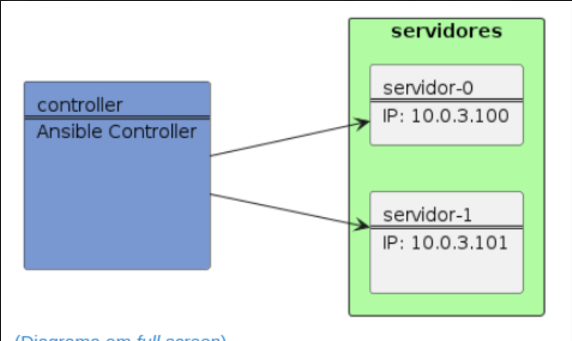

# Lab 01 - Run Ad-Hoc Commands

## Contents

- [Objective](#objective)
- [Prerequisites](#prerequisites)
- [Guide](#guide)
  - [Step 1: Verify Ansible installation](#step-1-verify-ansible-installation)
  - [Step 2: Run first ad-hoc command](#step-2-run-first-ad-hoc-command)
  - [Step 3: Copy file locally](#step-3-copy-file-locally)
  - [Step 4: Create SSH keys](#step-4-create-ssh-keys)
  - [Step 5: Create inventory file](#step-5-create-inventory-file)
  - [Step 6: Run ping command on multiple nodes](#step-6-run-ping-command-on-multiple-nodes)
  - [Step 7: Run ping command using nodes group name](#step-7-run-ping-command-using-nodes-group-name)
  - [Step 8: Copy file to multiple nodes](#step-8-copy-file-to-multiple-nodes)
  - [Step 9: Run command on multiple nodes](#step-9-run-command-on-multiple-nodes)
- [Conclusion](#conclusion)

## Objective

This lab is designed to provide hands-on experience with Ansible, focusing on fundamental tasks such as verifying installation, managing files, creating SSH keys, and executing basic commands on remote nodes.

## Prerequisites

- [ ] Ansible is installed on the control node
- [ ] Python 3 (version 3.5 or later) is installed on the target nodes
- [ ] Create a folder named `ansible-labs` in your home directory
- [ ] Create a folder named `lab01` inside `ansible-labs`
- [ ] Navigate to `lab01` folder

## Guide

### Step 1: Verify Ansible installation

Access your control node and verify that Ansible is installed:

```bash
ansible --version
```

You should see output similar to the following:

```bash
ansible 2.9.6
  config file = /home/ansible/ansible.cfg
  configured module search path = ['/home/ansible/.ansible/plugins/modules', '/usr/share/ansible/plugins/modules']
  ansible python module location = /home/ansible/.local/lib/python3.6/site-packages/ansible
  executable location = /home/ansible/.local/bin/ansible
  python version = 3.6.9 (default, Apr 18 2020, 01:56:04) [GCC 8.4.0]
```

### Step 2: Run first ad-hoc command

Run the following command to ping localhost:

```bash
ansible localhost -m ping
```

You should see output similar to the following:

```bash
localhost | SUCCESS => {
    "changed": false,
    "ping": "pong"
}
```

This module is used to check if the target machine is reachable. It does not require Python on the remote system, just a reachable network connection and SSH. Because this module does not require Python, it is useful for checking if the remote host is able to be communicated with by Ansible.

Look at command structure:

```bash
ansible <host-pattern> -m <module> [options]
```

- `host-pattern`: The pattern that defines which hosts will be affected by the command. This can be a single host, a group of hosts, or all hosts.
- `module`: The module that will be executed on the remote host. This is the action that will be performed on the remote host.
- `options`: The options that will be passed to the module. These are module-specific.

### Step 3: Copy file locally

First, let's create a file to copy:

```bash
echo "Hello World" > ~/hello.txt
```

Now run the following command to copy the file to `/tmp`:

```bash
ansible localhost -m ansible.builtin.copy -a "src=~/hello.txt dest=/tmp/"
```

### Step 4: Create SSH keys

For this step check on next image the infrastructure diagram to be used during all the labs:



You are running this commands from `controler` node and your managed nodes are `servidor-0` and `servidor-1`.

To generate new SSH keys, you can use  run the following command:

```bash
ansible localhost -m ansible.builtin.openssh_keypair -a "path=/home/vagrant/.ssh/ansible"
```

Now, copy the public key to the remote server `servidor-0`:

```bash
ssh-copy-id -i ~/.ssh/ansible.pub vagrant@servidor-0
```

You should get a prompt to enter the password for the `vagrant` user. Enter the password and press `Enter`.

Repeat this step for the remote server `servidor-1`:

```bash
ssh-copy-id -i ~/.ssh/ansible.pub vagrant@servidor-1
```

Finally, to reference the key in Ansible, you need to create a file named `ansible.cfg` in `lab01` directory and add the following content:

```bash
[defaults]
private_key_file = /home/vagrant/.ssh/ansible
```

### Step 5: Create inventory file

Create a file named `inventory.ini` in `lab01` directory and add the following content:

```ini
[nodes]
servidor-0
servidor-1
```

### Step 6: Run ping command on multiple nodes

Run the following command to ping all nodes:

```bash
ansible all -i inventory.ini -m ansible.builtin.ping
```

Since you're running for 2 nodes, you should see output similar to the following:

```bash
servidor-0 | SUCCESS => {
    "changed": false,
    "ping": "pong"
}
servidor-1 | SUCCESS => {
    "changed": false,
    "ping": "pong"
}
```

To use the inventory file, you need to use the `-i` option. This option allows you to specify the path to the inventory file. If you don't specify this option, Ansible will use the default inventory file, which is located at `/etc/ansible/hosts`.

You can use `ansible-inventory` command to list all hosts:

```bash
ansible-inventory -i inventory.ini --list
```

To avoid using the `-i` option every time you run a command, you can add the following content in `ansible.cfg` file in `lab01` directory:

```bash
inventory = inventory.ini
```

### Step 7: Run ping command using nodes group name

Run the following command to ping all nodes:

```bash
ansible nodes -m ansible.builtin.ping
```

Since you're running for 2 nodes, you should see output similar to the following:

```bash
servidor-0 | SUCCESS => {
    "changed": false,
    "ping": "pong"
}
servidor-1 | SUCCESS => {
    "changed": false,
    "ping": "pong"
}
```

On this case, the result is the same as the previous step, since we only have this group. On next labs, we will create more groups and you will see the difference.

But you can also run the following command to ping one node:

```bash
ansible nodes -m ansible.builtin.ping -l servidor-0
```

### Step 8: Copy file to multiple nodes

Run the following command to copy the previous created file to `/tmp` on all nodes:

```bash
ansible all -m ansible.builtin.copy -a "src=/tmp/hello.txt dest=/tmp/"
```

You should see output similar to the following:

```bash
servidor-0 | CHANGED => {
    "changed": true,
    "checksum": "e2fc714c4727ee9395f324cd2e7f331f",
    "dest": "/tmp/hello.txt"
    ...
}
servidor-1 | CHANGED => {
    "changed": true,
    "checksum": "e2fc714c4727ee9395f324cd2e7f331f",
    "dest": "/tmp/hello.txt"
    ...
}
```

### Step 9: Run command on multiple nodes

Run the following command to list `/tmp` folder on all nodes:

```bash
ansible all -m ansible.builtin.shell -a "ls /tmp"
```

You should see output similar to the following:

```bash
servidor-0 | CHANGED | rc=0 >>
hello.txt
...
servidor-1 | CHANGED | rc=0 >>
hello.txt
...
```

Let's check if the file was copied correctly:

```bash
ansible all -m ansible.builtin.shell -a "cat /tmp/hello.txt"
```

You should see output similar to the following:

```bash
servidor-0 | CHANGED | rc=0 >>
Hello World
servidor-1 | CHANGED | rc=0 >>
Hello World
```

## Conclusion

Congratulations! You've completed the lab exercise.

These instructions will guide you through basic Ansible operations such as checking installation, copying files, creating and distributing SSH keys, managing inventory, and executing commands on remote nodes.
